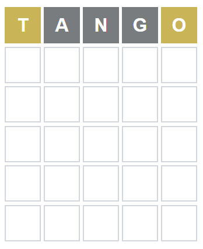
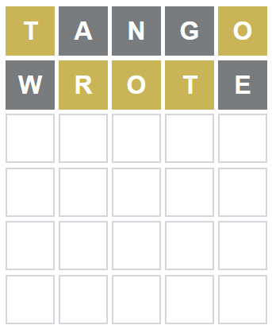
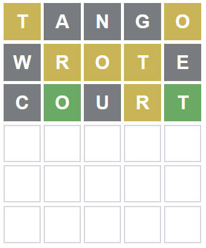
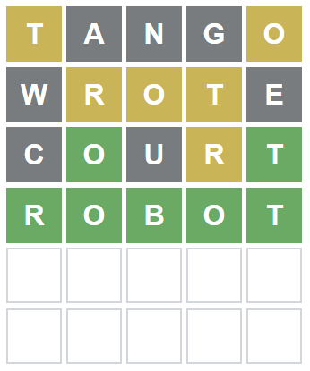

# Wordle Helper.

This is a small python program which helps in solving the popular word puzzle called wordle([Link](https://www.powerlanguage.co.uk/wordle/)). Program takes three optional inputs for each one of the colored clues. For gray clues enter the list of characters (ie. 'cde') while for the green and yellow clues enter the list of character/position pairs (ie. 'a2b3'). Here is an example of how it works. 

##### Example

Start with a random guess. I started with "TANGO".  
<div align=center></div>

Based on the clues in first row run the function as follows.
```shell
>> python main.py --yellow t1o5 --gray ang

Output:
List of words: ['other', 'story', 'short', 'stood', 'wrote', 'mouth', 'south', 'store', 'forth', 'roots', 'cloth', 'worth', 'court', 'doubt', 'storm', 'stock', 'outer', 'costs', 'youth', 'motor', 'orbit', 'shoot', 'route', 'forty', 'hotel', 'boots', 'pilot', 'stove',
'spots', 'shout', 'worst', 'stops', 'moist', 'sport', 'shots', 'poets', 'sorts', 'posts', 'frost', 'hosts', 'ports', 'votes', 'voted', 'robot', 'stole', 'stool', 'moths', 'scout', 'stout', 'motel', 'bolts', 'lofty', 'quote', 'booth', 'forts', 'colts', 'otter', 'spout'
, 'smote', 'stoop', 'rotor', 'plots', 'pivot', 'comet', 'depot', 'boost', 'broth', 'slots', 'sloth', 'riots', 'volts', 'roost', 'hotly', 'idiot', 'booty', 'voter', 'bouts', 'hoist', 'molts', 'stork', 'covet', 'stomp', 'omits', 'extol', 'clout', 'froth', 'vomit', 'lotu
s', 'clots', 'blots', 'hoots', 'optic', 'scoot', 'doted', 'jolts', 'dolts', 'stows', 'routs', 'joist', 'pouts', 'loots', 'soots', 'ousts', 'flout', 'dotes', 'lofts', 'overt', 'motif', 'quoth', 'forte', 'sooty', 'ethos', 'motes', 'opted', 'dotty', 'joust', 'motet', 'st
oic', 'louts', 'divot', 'stoke', 'croft', 'coots', 'moult', 'softy', 'potty', 'posit', 'octet', 'botch', 'estop', 'sooth', 'emote', 'owlet', 'roust', 'foist', 'coset', 'strop', 'obits', 'poset', 'doest', 'morts', 'dicot', 'didot', 'foots', 'wroth', 'rooty', 'softs', '
poste', 'mothy', 'cotes', 'ioctl', 'zloty', 'mosts', 'stoup', 'oweth', 'quoit', 'couth', 'owest', 'fetor', 'picot', 'worts', 'doter', 'besot', 'doeth', 'moots']
Number of words: 165
```
Next pick a word from the list. I picked "WROTE" as second guess.  
<div align=center></div> 

Run the code again with additional clues included.
```shell
>> python main.py --yellow t1o5r2o3t4 --gray angwe

Output:
List of words: ['court', 'motor', 'robot', 'rotor', 'roust', 'strop']
Number of words: 6
```

Third guess is "COURT".
<div align=center></div>

Run the code again with additional clues included.

<div align=center></div>